# MacPulse

MacPulse is a native macOS telemetry application that reports processor activity, graphics activity, memory state, selected power measurements, and hardware metadata. It runs as a menu-bar accessory application and includes WidgetKit extensions for desktop presentation.

This repository contains the source code, Xcode project, tests, local build scripts, DMG packaging scripts, and technical documentation for MacPulse 2.1.2.

Developed by [TerabitLab](https://terabitlab.com/).

Repository: `https://github.com/vluncasu/macpulse`

<p align="center">
  <a href="https://github.com/vluncasu/macpulse/releases/download/v2.1.2/MacPulse-2.1.2.dmg"><strong>Download MacPulse 2.1.2 for macOS (.dmg)</strong></a><br>
  <sub>Universal application for Apple Silicon and Intel Macs · macOS 13 or newer</sub>
</p>

## Download

[Download MacPulse 2.1.2 for macOS (DMG)](https://github.com/vluncasu/macpulse/releases/download/v2.1.2/MacPulse-2.1.2.dmg) or open the [v2.1.2 release page](https://github.com/vluncasu/macpulse/releases/tag/v2.1.2) for checksums and release notes.

> [!IMPORTANT]
> Installable Mac binaries are published as **GitHub Release assets**, not under Packages. [GitHub Packages](https://docs.github.com/en/packages/learn-github-packages/introduction-to-github-packages) provides registries for formats such as npm, Maven, NuGet, RubyGems, and containers; it is not a generic DMG download area. The verified MacPulse DMG is attached directly to the release above.

This is the No-Team build: it is ad-hoc signed and is not Apple-notarized. macOS may therefore block its first launch. After dragging `MacPulse.app` to Applications, use Finder to Control-click the application, choose **Open**, and confirm only if the downloaded SHA-256 matches the checksum published with the release. Users who require a verified publisher identity should build from source or use a future Developer ID signed and notarized release.

## Product tour

The interface is shown in its normal usage order: first the live menu-bar dashboard, then the desktop widgets. These are real captures from an Intel/AMD test system; available fields and numeric values depend on the Mac and the telemetry exposed by its active macOS drivers.

### Menu-bar dashboard

<table>
  <tr>
    <td width="50%" align="center">
      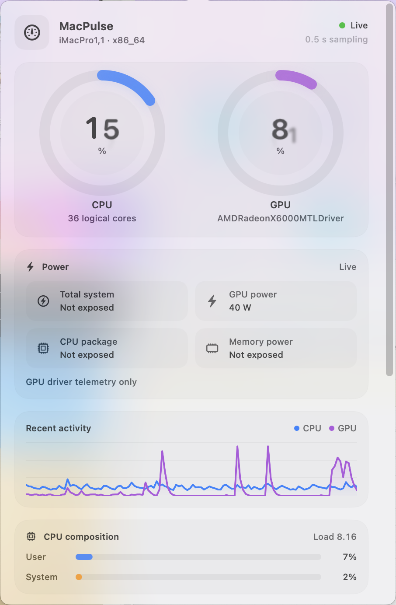
    </td>
    <td width="50%" align="center">
      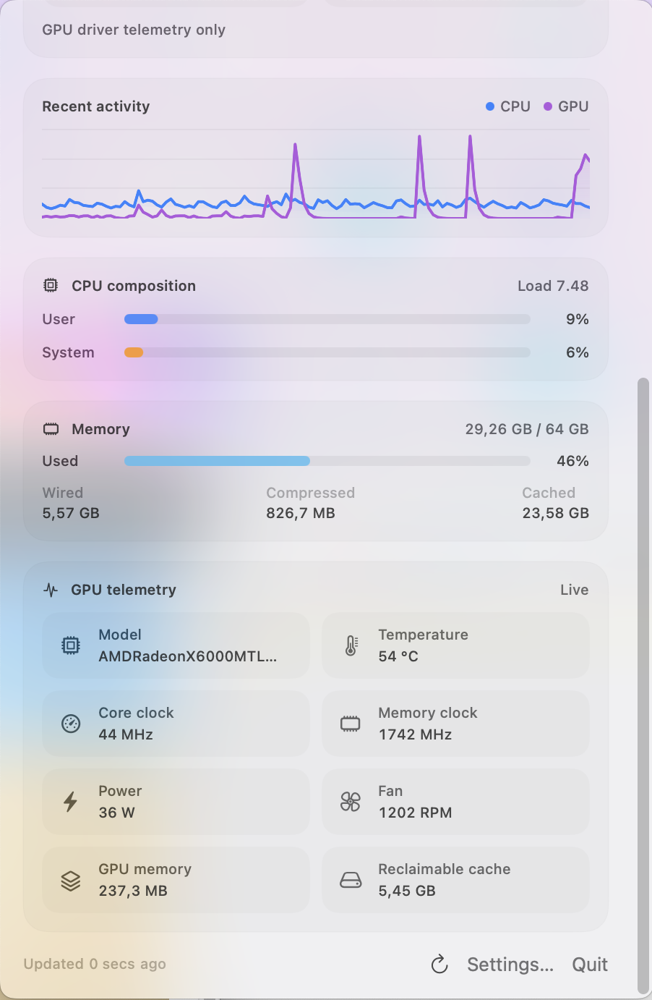
    </td>
  </tr>
  <tr>
    <td align="center"><sub><strong>Live overview</strong><br>CPU, GPU, power, history, and CPU composition.</sub></td>
    <td align="center"><sub><strong>Detailed telemetry</strong><br>Memory, temperature, clocks, fan, power, and GPU memory when exposed.</sub></td>
  </tr>
</table>

### Desktop widgets

<table>
  <tr>
    <td width="50%" align="center">
      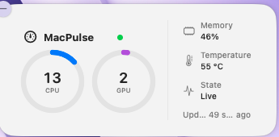
    </td>
    <td width="50%" align="center">
      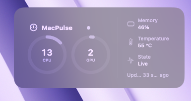
    </td>
  </tr>
  <tr>
    <td align="center"><sub><strong>Standard appearance</strong><br>Compact CPU, GPU, memory, temperature, and freshness state.</sub></td>
    <td align="center"><sub><strong>Tinted appearance</strong><br>The same information adapted to the selected desktop treatment.</sub></td>
  </tr>
</table>

<details>
<summary><strong>View all WidgetKit layouts</strong></summary>
<br>
<table>
  <tr>
    <td width="50%" align="center">
      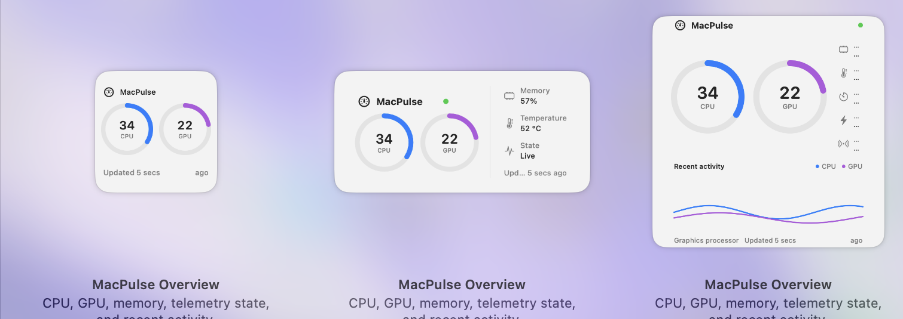
    </td>
    <td width="50%" align="center">
      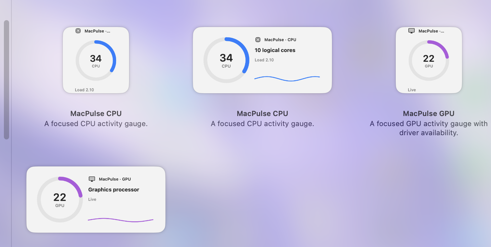
    </td>
  </tr>
  <tr>
    <td align="center"><sub><strong>Overview family</strong><br>Small, medium, and large layouts.</sub></td>
    <td align="center"><sub><strong>Focused metrics</strong><br>Dedicated CPU and GPU layouts.</sub></td>
  </tr>
</table>
</details>

### Settings

Every settings surface is included below. The captures are cropped to the application window and exclude unrelated desktop, account, browser, and file information.

<table>
  <tr>
    <td width="50%" align="center">
      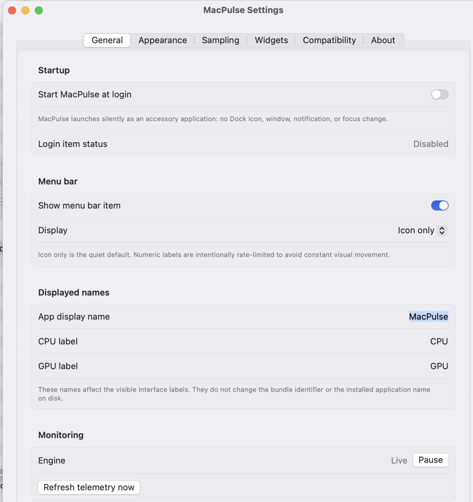
    </td>
    <td width="50%" align="center">
      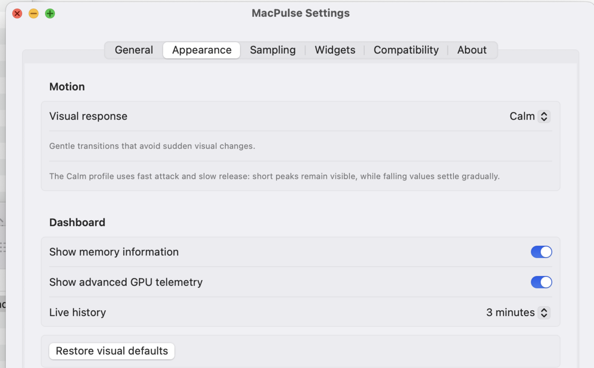
    </td>
  </tr>
  <tr>
    <td align="center"><sub><strong>General</strong><br>Startup, menu-bar display, labels, and monitoring controls.</sub></td>
    <td align="center"><sub><strong>Appearance</strong><br>Visual response, dashboard fields, and history duration.</sub></td>
  </tr>
  <tr>
    <td width="50%" align="center">
      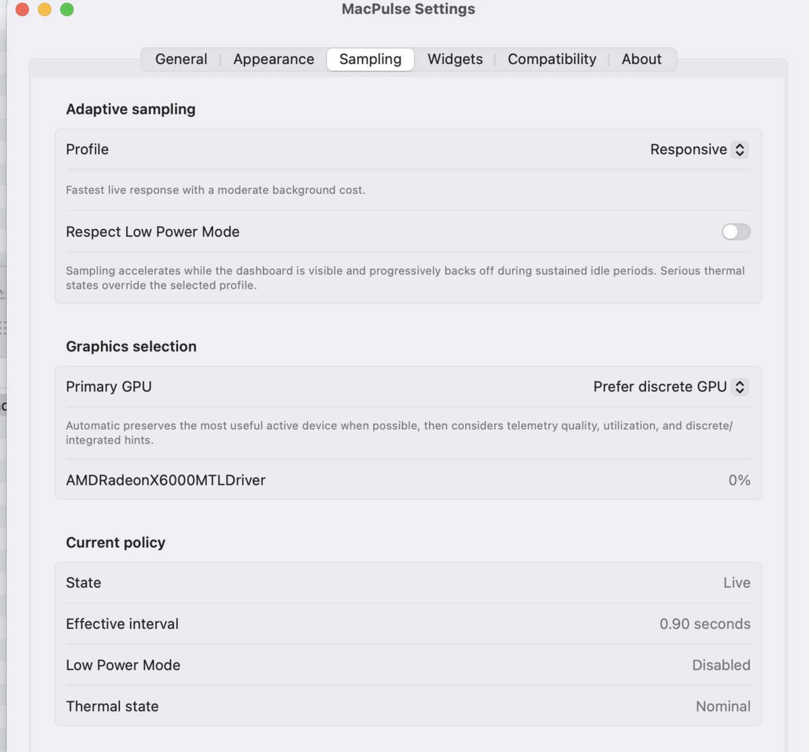
    </td>
    <td width="50%" align="center">
      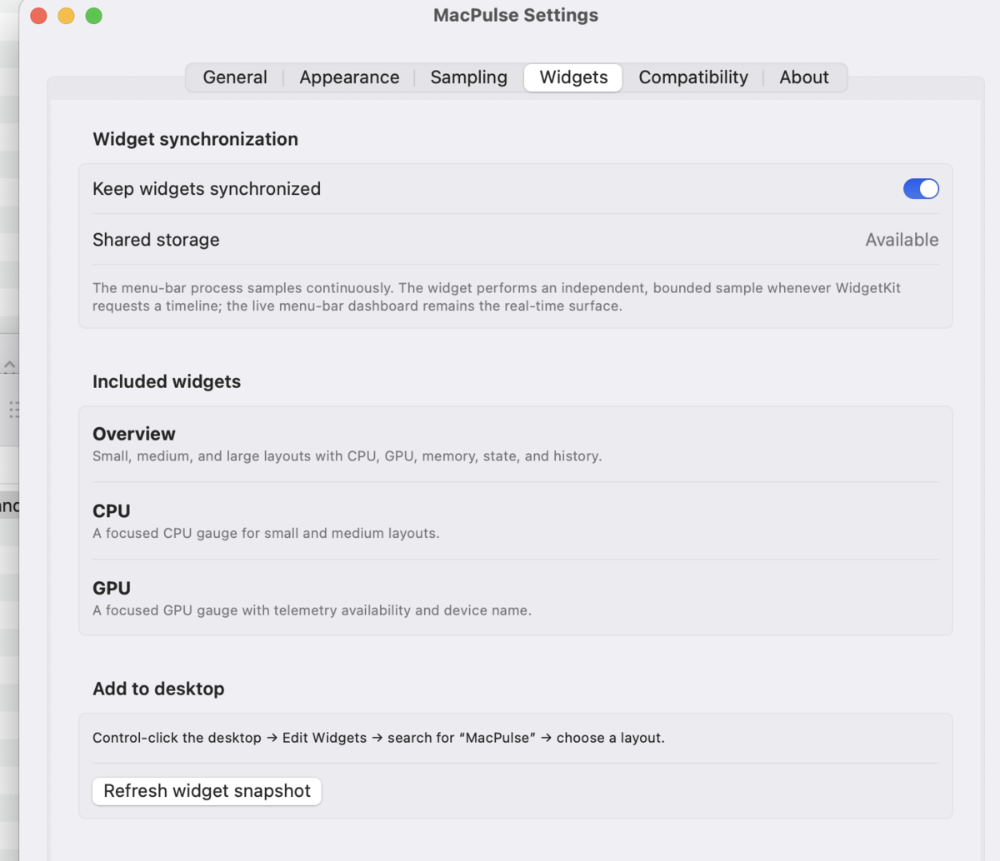
    </td>
  </tr>
  <tr>
    <td align="center"><sub><strong>Sampling</strong><br>Adaptive profile, Low Power Mode, GPU selection, and effective policy.</sub></td>
    <td align="center"><sub><strong>Widgets</strong><br>Synchronization, included families, and desktop setup.</sub></td>
  </tr>
  <tr>
    <td width="50%" align="center">
      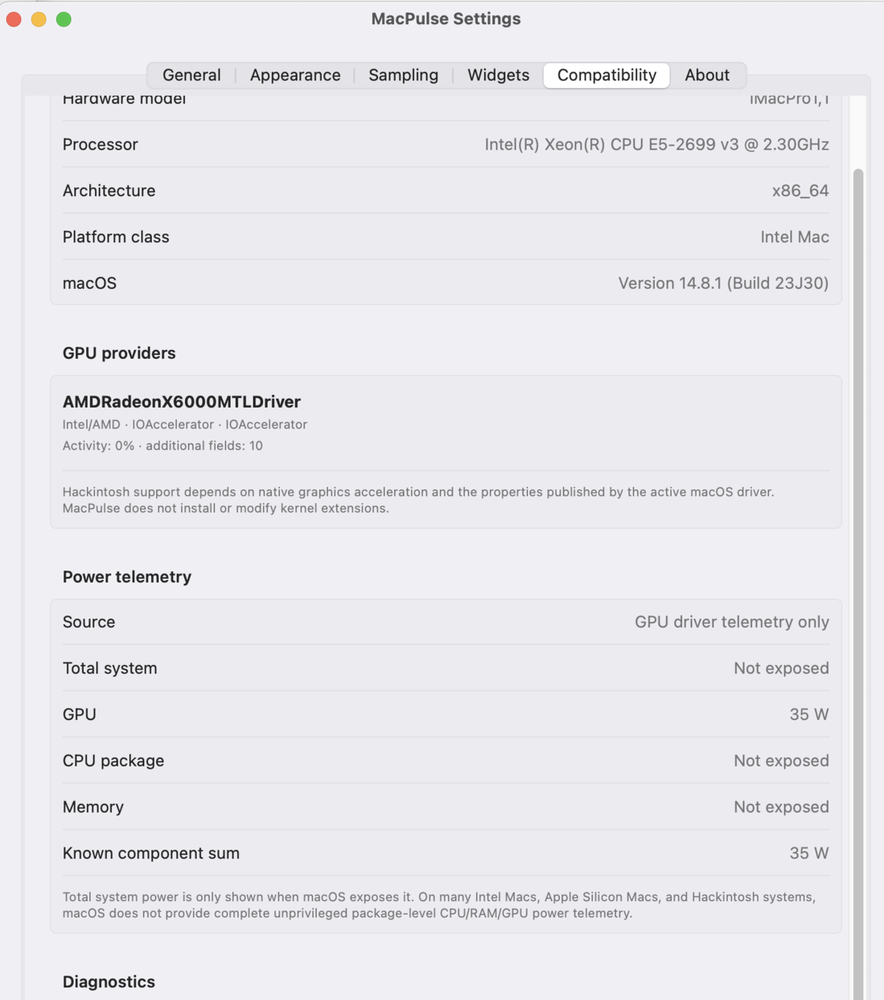
    </td>
    <td width="50%" align="center">
      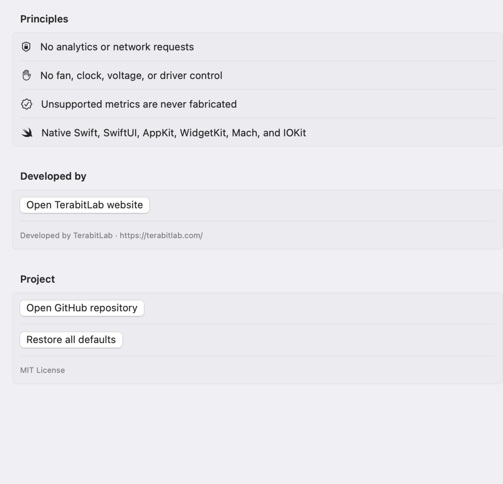
    </td>
  </tr>
  <tr>
    <td align="center"><sub><strong>Compatibility</strong><br>Hardware metadata, telemetry providers, power fields, and diagnostics.</sub></td>
    <td align="center"><sub><strong>About</strong><br>Privacy principles, project links, defaults, and license.</sub></td>
  </tr>
</table>

## 1. Scope

MacPulse has four defined functions:

1. sample CPU utilization from public Mach host statistics;
2. sample GPU telemetry from properties published by macOS graphics drivers in IORegistry;
3. present telemetry in a menu-bar dashboard and WidgetKit widgets;
4. adapt sampling frequency according to interface visibility, system activity, Low Power Mode, and thermal state.

MacPulse is a read-only monitor. It does not modify fan curves, frequencies, voltages, power limits, drivers, kernel extensions, or firmware settings.

## 2. Supported systems

The application targets macOS 13 or newer and builds as a universal binary for `arm64` and `x86_64`.

| Platform | CPU activity | GPU activity | Extended GPU fields | Power fields |
|---|---:|---:|---:|---:|
| Apple Silicon Mac | Supported | Driver-dependent through `AGXAccelerator` | Driver-dependent | Battery total where exposed; other fields may be unavailable |
| Intel Mac with Intel graphics | Supported | Driver-dependent through `IOAccelerator` | Driver-dependent | Battery total where exposed |
| Intel Mac with AMD graphics | Supported | Commonly exposed through `IOAccelerator` | Temperature, clocks, fan, power, and VRAM may be exposed | GPU power may be exposed by the driver |
| Accelerated Hackintosh | Supported | Depends on native macOS graphics acceleration | Depends on the active driver and injected properties | Hardware- and driver-dependent |
| macOS virtual machine | Supported | Only when the hypervisor exposes a compatible accelerated service | Hypervisor-dependent | Usually unavailable |
| Unaccelerated framebuffer | Supported | Unavailable | Unavailable | Usually unavailable |

Compatibility means that MacPulse can consume telemetry already published by macOS. It does not enable unsupported graphics hardware.

## 3. Measurement definitions

### 3.1 CPU utilization

CPU utilization is computed from consecutive `HOST_CPU_LOAD_INFO` samples.

For two consecutive observations:

```text
active = delta(user) + delta(system) + delta(nice)
total  = active + delta(idle)
CPU utilization = 100 * active / total
```

User and system components are retained separately. The displayed value is filtered for visual stability; the unfiltered value remains available in the internal snapshot.

### 3.2 CPU load average

The one-, five-, and fifteen-minute load averages are obtained from the operating system. They represent runnable and uninterruptible work relative to time. They are not percentages and are not normalized by logical processor count.

### 3.3 GPU utilization

The GPU reader enumerates `AGXAccelerator` and `IOAccelerator` services through IOKit. It searches nested driver dictionaries for documented and commonly published property names, including:

```text
Device Utilization %
Device Utilization
GPU Activity(%)
GPU Activity %
GPU Utilization %
GPU Core Utilization
Renderer Utilization
accelBusyPercent
GPU Busy %
```

A value is accepted only when it can be parsed as a finite number. Unit fractions in the interval `(0, 1]` are converted to percentages. Final percentages are constrained to the interval `[0, 100]`.

The reader does not interpret an absent property as zero. The state is reported as unavailable. A temporary failed read can retain the preceding valid value for a bounded interval and marks the sample as stale.

### 3.4 GPU selection

Systems may publish multiple GPU services or multiple telemetry dictionaries for one physical device. MacPulse:

1. enumerates all matching services;
2. derives stable identifiers from IORegistry entry identifiers;
3. merges complementary fields from duplicate observations;
4. scores observations by telemetry completeness and current activity;
5. applies the selected policy: automatic, highest activity, prefer discrete, or prefer integrated;
6. retains limited continuity to prevent rapid switching between devices.

The automatic policy gives priority to active observations with usable utilization values. A previously selected device receives only a limited continuity preference and cannot permanently suppress an active alternative.

### 3.5 Memory

Memory data is derived from `HOST_VM_INFO64`. MacPulse reports total, estimated used, wired, compressed, and reclaimable cached memory. The displayed pressure value is a documented proxy based on constrained memory. It is not presented as a reproduction of Apple Activity Monitor's private memory-pressure algorithm.

### 3.6 Power

Power telemetry is incomplete on many macOS systems. MacPulse follows the following policy:

- total system power is displayed only when a battery power source exposes voltage and instantaneous current;
- GPU power is displayed only when the graphics driver publishes a power property;
- CPU package power and memory power remain unavailable unless a reliable public source is present;
- unavailable fields are displayed as `Not exposed`;
- component values are not added to an invented total;
- no private SMC interface, privileged helper, or external command requiring administrator access is used.

On desktop Macs without a battery, total wall power cannot be derived from public battery telemetry. Accurate wall power requires an external power meter.

## 4. User interface

### 4.1 Menu-bar application

MacPulse runs with `LSUIElement` enabled. It does not appear in the Dock and does not open a window at launch. The status item can show:

- icon only;
- CPU percentage;
- CPU and GPU percentages.

The numeric menu-bar title is rate-limited to avoid continuous layout movement.

### 4.2 Dashboard

The menu-bar popover is the live surface. It displays:

- CPU and GPU circular gauges;
- CPU user and system composition;
- recent CPU and GPU history;
- memory statistics;
- detected graphics devices;
- GPU temperature, clock, fan, power, and memory fields when available;
- total system and component power fields when available;
- telemetry freshness and sampling interval.

Visible labels for the application, CPU, and GPU can be changed in Settings. These changes affect interface text only. They do not change bundle identifiers, filenames, widget kinds, or installed application metadata.

### 4.3 Widgets

The extension provides overview, CPU, and GPU widgets in multiple sizes. WidgetKit controls execution and refresh scheduling. The widgets therefore provide periodic snapshots, not a guaranteed one-second live display.

The no-team edition does not use an App Group entitlement. The widget performs an independent bounded sample when WidgetKit requests a timeline.

## 5. Adaptive sampling

Sampling is controlled by a deterministic policy with three user profiles: Responsive, Balanced, and Efficient. The policy considers:

- whether the dashboard is visible;
- sustained low activity;
- Low Power Mode;
- thermal state;
- sleep and wake transitions.

GPU polling can be slower than CPU polling because IORegistry traversal is comparatively more expensive. Sampling intervals are operational targets, not real-time guarantees.

## 6. Architecture

```text
MacPulse.app
  AppDelegate
  StatusItemController
  SettingsWindowController
  MonitorStore
    CPUReader
    MemoryReader
    PowerReader
    GPUReader
      IOKit enumeration
      GPUStatisticsParser
    MetricSmoother
    SamplingPolicy
  SwiftUI dashboard and settings

MacPulseWidget.appex
  TimelineProvider
  bounded CPU/GPU/memory/power sample
  small, medium, and large SwiftUI layouts
```

The application uses public macOS frameworks:

- AppKit;
- SwiftUI;
- WidgetKit;
- Foundation;
- Combine;
- Mach host APIs;
- IOKit;
- ServiceManagement.

No external runtime dependency is required.

## 7. Building without an Apple Developer Team ID

Requirements:

- macOS 13 or newer;
- Xcode 15 or newer;
- Xcode command-line tools;
- no paid Apple Developer membership is required for the local build.

Double-click:

```text
Build and Install MacPulse.command
```

or run:

```bash
./scripts/doctor.sh
./scripts/build-local.sh
./scripts/install-local.sh
```

The build uses ad-hoc signing:

```text
CODE_SIGN_STYLE=Manual
CODE_SIGN_IDENTITY=-
DEVELOPMENT_TEAM=
PROVISIONING_PROFILE_SPECIFIER=
```

Ad-hoc signing is suitable for local execution. It is not a substitute for Developer ID signing and notarization.

## 8. Creating a drag-to-install DMG

Double-click:

```text
Build and Create DMG.command
```

The script performs the following operations:

1. validates the macOS/Xcode environment;
2. builds a universal Release application with an ad-hoc signature;
3. verifies the application and embedded widget signature;
4. creates a staging volume containing `MacPulse.app` and an `Applications` shortcut;
5. configures a Finder icon-view window;
6. creates a compressed read-only DMG;
7. verifies the disk image;
8. writes a SHA-256 checksum.

The output is written to:

```text
dist/MacPulse.app
dist/MacPulse-2.1.2-local.zip
dist/MacPulse-2.1.2.dmg
dist/MacPulse-2.1.2.dmg.sha256
dist/SHA256SUMS.txt
```

When the DMG is opened, install the application by dragging `MacPulse.app` onto the `Applications` shortcut.

The same process can be run from Terminal:

```bash
./scripts/build-and-package.sh
```

To package an existing application bundle:

```bash
./scripts/package-dmg.sh ./dist/MacPulse.app
```

## 9. Distribution constraints

A DMG is a container format. Creating a DMG does not establish publisher identity and does not satisfy Gatekeeper distribution requirements.

For use on the same Mac, the ad-hoc build is sufficient. For distribution to other users without security warnings, the application must be:

1. signed with a `Developer ID Application` certificate;
2. submitted to Apple's notarization service;
3. stapled after successful notarization;
4. packaged into the final DMG;
5. optionally notarized and stapled again as a disk image.

A paid Apple Developer Program membership is required for Developer ID distribution.

Detailed procedures are provided in [docs/DISTRIBUTION.md](docs/DISTRIBUTION.md) and [docs/BUILDING.md](docs/BUILDING.md).

## 10. Privacy and security

MacPulse:

- performs no network requests during normal operation;
- contains no analytics or advertising SDK;
- requires no account;
- does not collect device identifiers;
- does not read user documents;
- does not request administrator privileges;
- does not install a privileged helper;
- does not modify hardware control settings.

Diagnostic export excludes user name, host name, filesystem paths, serial number, and network identifiers.

See [docs/PRIVACY.md](docs/PRIVACY.md) and [SECURITY.md](SECURITY.md).

## 11. Validation

The repository contains:

- parser tests for representative GPU property dictionaries;
- metric smoothing tests;
- portable core tests;
- source-validation scripts;
- Xcode project validation;
- plist and entitlement validation;
- shell-script syntax validation;
- application and DMG signature/integrity checks on macOS.

Hardware validation remains necessary because GPU and power telemetry are driver-specific. The validation matrix is maintained in [docs/HARDWARE_VALIDATION_MATRIX.md](docs/HARDWARE_VALIDATION_MATRIX.md).

## 12. Repository structure

```text
MacPulse/                 Application target
MacPulseWidget/           WidgetKit extension
Shared/                   Shared data structures and policy
MacPulseTests/            Xcode unit tests
CoreSources/              Portable source links
CoreTests/                Portable Swift tests
scripts/                  Build, install, package, and release scripts
docs/                     Technical documentation
docs/images/screenshots/  Curated public product captures
MacPulse.xcodeproj/        Xcode project
```

## 13. License

MacPulse is distributed under the MIT License. See [LICENSE](LICENSE).
